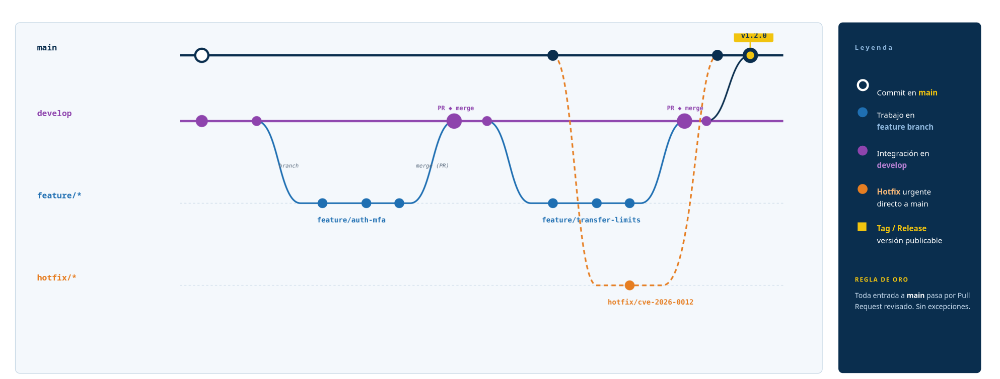

# SecureBank API

Proyecto académico de DevSecOps.

## Descripción

SecureBank API es una API bancaria simulada utilizada
para estudiar arquitectura, seguridad y automatización
CI/CD.

## Arquitectura

El proyecto se divide en:

- src: código fuente
- tests: pruebas
- docs: documentación y threat modeling
- .github: automatización y reglas del repositorio

## Configuración de repositorio

Este proyecto sigue un flujo de trabajo basado en ramas protegidas, con integración continua vía Pull Requests.

### Estrategia de ramas

- **`main`**: rama de producción. Contiene únicamente código estable y liberado. Cada commit en `main` representa una versión publicable.
- **`develop`**: rama de integración. Las features terminadas se mezclan acá antes de pasar a `main`.
- **`feature/*`**: ramas de desarrollo de nuevas funcionalidades, creadas desde `develop` (ej. `feature/auth-mfa`, `feature/transfer-limits`).
- **`hotfix/*`**: ramas para correcciones urgentes de seguridad o bugs críticos, creadas directamente desde `main` cuando no se puede esperar al ciclo normal (ej. `hotfix/cve-2026-0012`).

### Flujo de trabajo

1. Se crea una rama `feature/*` desde `develop` para cada nueva funcionalidad.
2. Al finalizar, se abre un **Pull Request** hacia `develop` para su revisión e integración.
3. Cuando `develop` acumula suficientes cambios estables, se abre un PR de `develop` hacia `main`.
4. Los releases publicables se marcan con un **tag** de versión (ej. `v1.2.0`) sobre `main`.
5. Ante una vulnerabilidad o bug urgente, se crea una rama `hotfix/*` directo desde `main`, se corrige y se mergea de vuelta a `main` (y luego se sincroniza con `develop`).

> ⚠️ **Regla de oro:** toda entrada a `main` pasa por Pull Request revisado. Sin excepciones.
